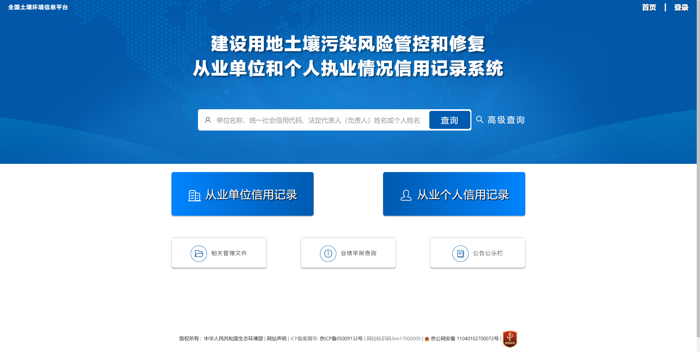

# 智慧环保-建设用地土壤污染风险管控和修复从业单位和个人执业情况信用记录系统

#### 介绍
智慧环保-建设用地土壤污染风险管控和修复从业单位和个人执业情况信用记录系统
系统简介：通过建设用地土壤污染风险管控和修复从业单位和个人执业情况信用记录系统实现对建设用地土壤污染风险管控和修复从业单位和个人执业情况信用信息实行清单管理，实现对从业单位和从业个人的基本情况信息、业绩情况信息、报告评审信息、行政处罚信息和虚假业绩信息举报核实情况实现清单管理
使用部门：国家、省、市、县各级环保部门、从业单位
主要成效：通过信用记录系统，完成了对1万多家从业单位以及近5万名从业个人的信息管理；完成填报了11种不同项目类别的7万多条项目业绩信息，为国家对企业及个人的信用监管作出了显著贡献。

商务合作 WeChat: 2609375767
#### 软件架构
软件架构说明

前端：vue

后台：spring-boot

#### 系统截图
1. 登录页

   
2. 首页

3. 文件管理

4. 虚假举报

5. 公告公示

